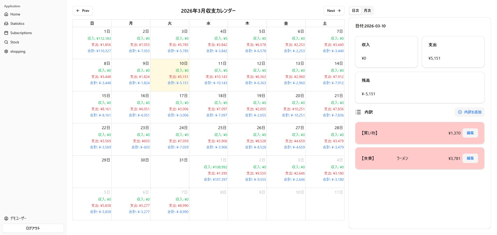
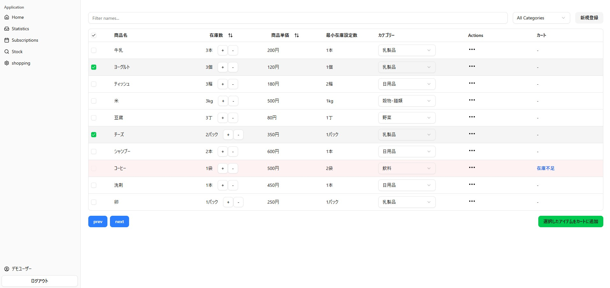
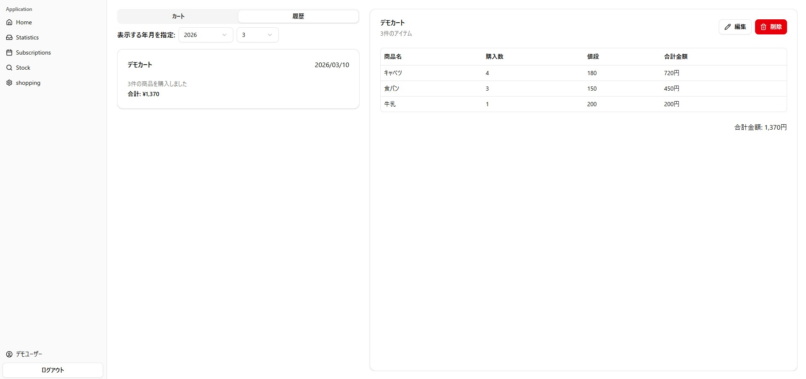
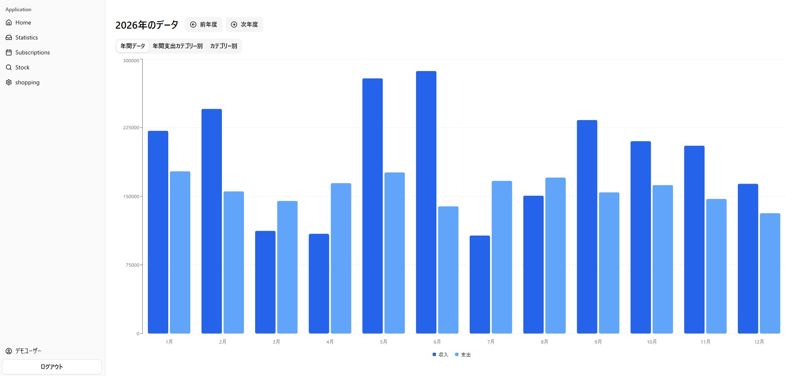
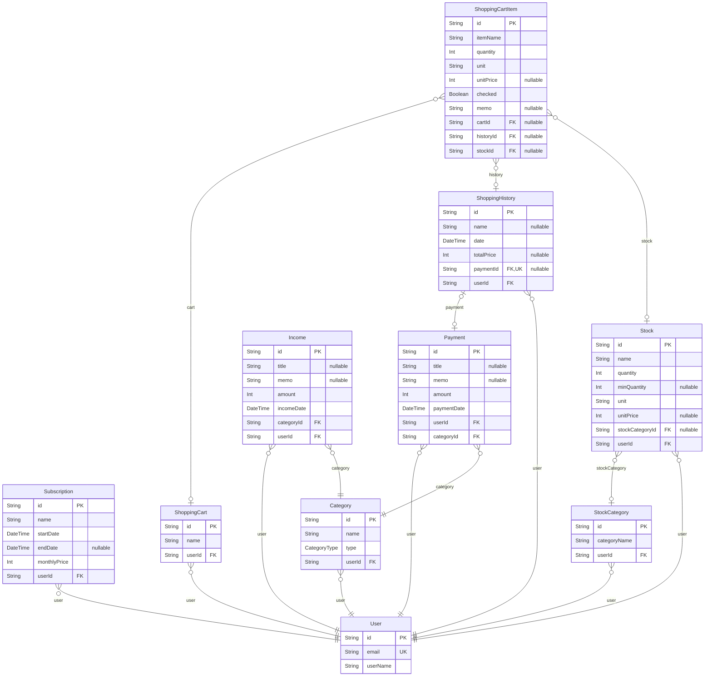

# プロジェクトの概要

MoneyNote は、**「買い物履歴」「収支カレンダー」「在庫管理」が自動連係する家計管理アプリ**です。

日々の買い物や消耗品を記録するだけで
在庫管理と家計簿が自動で更新されるため、
複数のアプリを使い分ける必要がなく
家計管理をシンプルに行うことができます。

**購入記録を一度入力するだけで、在庫管理と家計簿の両方が更新される設計になっています。**

# コンセプト

収支を管理するアプリは多くありますが、**買い物記録と在庫管理が連携しているものは少ない**と感じました。

そこで、買い物の記録を入力する際に在庫の更新も同時に行えるようにすることで、
**家計管理の手間を減らし、より効率的に管理できるアプリ**を目指しました。

また、実際の生活の中で
「買ったはずなのにもうなかった」 
「必要以上に買ってしまった」 
という経験があり、買い物記録と在庫管理が連携する仕組みがあれば便利だと考え、このアプリを作成しました。

# デモサイト

[MoneyNote](https://money-note-eight.vercel.app)
ゲストログインボタンからすぐにお試しいただけます。 
**※デモ環境のデータは定期的にリセットされる場合があります。**

# 主な機能

- 認証機能
  - Supabase Auth を使用したメールアドレスとパスワードによる認証
  - デモログイン機能
- 在庫管理機能
  - 在庫が規定数を下回ると自動で専用の買い物リストに追加
  - カテゴリー検索、キーワード検索
- 買い物リスト機能
  - 購入ボタン一つで在庫と収支に反映
  - 自動計算で購入金額を表示、手動で編集も可能
- 収支管理機能
  - 買い物の場合、自動で購入履歴と連携
  - 年間での収支グラフを表示

# 使用技術

- **フロントエンド**: Next.js(App Router),
  TypeScript, Tailwind CSS, shadcn/ui,
  React Hook Form, Zod, TanStack Table,
  Recharts, date-fns
- **バックエンド**: Prisma, PostgreSQL(Supabase)
- **認証**: Supabase Auth
- **デプロイ**: Vercel

# 技術選定理由

## 主要技術

- **Next.js**
  - React Router と違い、自分でルートを設定する必要がなく、
    フォルダで管理できるためコード量の削減や
    複数画面の管理がしやすいと判断したため
  - 自動コード分割により、各ページに必要なコードだけを
    読み込むことで、初回ロード時間を短縮できるため
  - React ベースで開発でき、フロントエンドとサーバー処理を
    一つのフレームワークで管理しやすいため
- **Vercel**
  - Next.js の開発元が提供しており、フレームワークとの相性が良いと考えたため
  - 簡単にデプロイできるため
- **Supabase**
  - 認証機能を比較的簡単に導入でき、ログイン機能の実装を進めやすいため
  - バックエンドを自分で構築する必要がなく、フロントエンドに集中して開発できるため
- **Prisma**
  - TypeScript との相性が良いため
  - SQL を書く必要がなく、データベースの操作が簡単になるため
  - 型が自動生成されるため、コードの安全性が向上するため
- **TypeScript**
  - 型定義により、実行前にエディター上でエラーを検出し、
    バグを早期発見することでデータの整合性を
    保つことができるため
  - エディターの補完機能を活かすことができるため、
    コーディングの効率が上がるため
  - コードの意図が明確になり可読性が上がるため
## ライブラリ
  - **Zod**
    - スキーマからTypeScriptの型を自動生成できるため、
    型定義の二重管理が不要になるため
    - バリデーションルールをスキーマとして一箇所で
    管理できるため、整合性が崩れにくいため
    - フォームのバリデーションを簡潔に実装できるため
  - **React Hook Form**
    - フォームの状態管理や値取得が簡単にできるため
    - フォームの項目ごとにstateを管理する必要がなく、コードをシンプルに保てるため

## スクリーンショット

### トップページ

### 在庫管理ページ

### 買い物リストページ

### 収支グラフページ

# ER 図

# 実装予定の機能

- サブスク管理(基本機能は実装済み)
  - 収支カレンダーとの連携
- モバイル対応(対応中)
